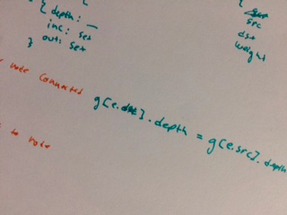

# An Update from the Cabal Club

hey friends!

i'm sitting here at my last language technology lab (the last course of credits i need to take as part of my master's
degree) and waiting until i can present my results. so i figured why not pitch out an update from the cabal-club 

## Updates

### Improved docs
[@fenwick67](https://github.com/fenwick67) _massively_ improved the docs for [`cabal-client`](https://github.com/cabal-club/cabal-client/)! 

Now, we have tons of source code comments and an autogenerated api page with a super slick table of contents, to get you where you
want to be in a hypertext click. Get educated in the link down under

### [API Documentation](https://github.com/cabal-club/cabal-client/blob/master/api.md)

### Proof of concept moderation
I spent the weekend at a cottage by the sea and started implementing the python proof of concept of #cblgh-thesis in
nodejs. It was a good start! I finally took the time to learn [`tape`](https://github.com/substack/tape)'s api. 

_misc scribbles while implementing the graph structure late at night_

I sketched up a dream api (thx [@RangerMauve](https://github.com/RangerMauve)) for that term) and
fleshed out the graph data structure I'll be using.

Once the core implementation is up to par, I'll implement it in a proof of concept fork of cabal. After that, if I have
time, I'll be simulating scenarios using Kubernetes in a swarm setup that my advisor has access to.

If my assumptions are validated the results will make their way into cabal proper and the modules published ^_^

_originally by @cblgh posted to [secure scuttlebutt](https://ssb.nz)_
